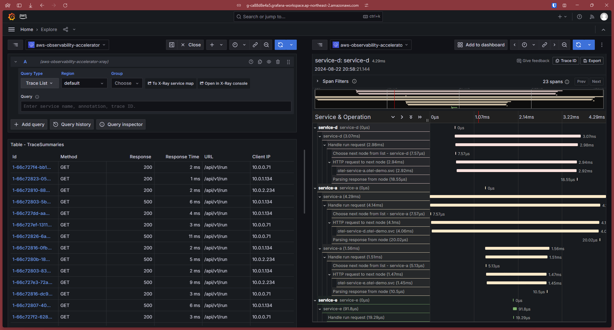
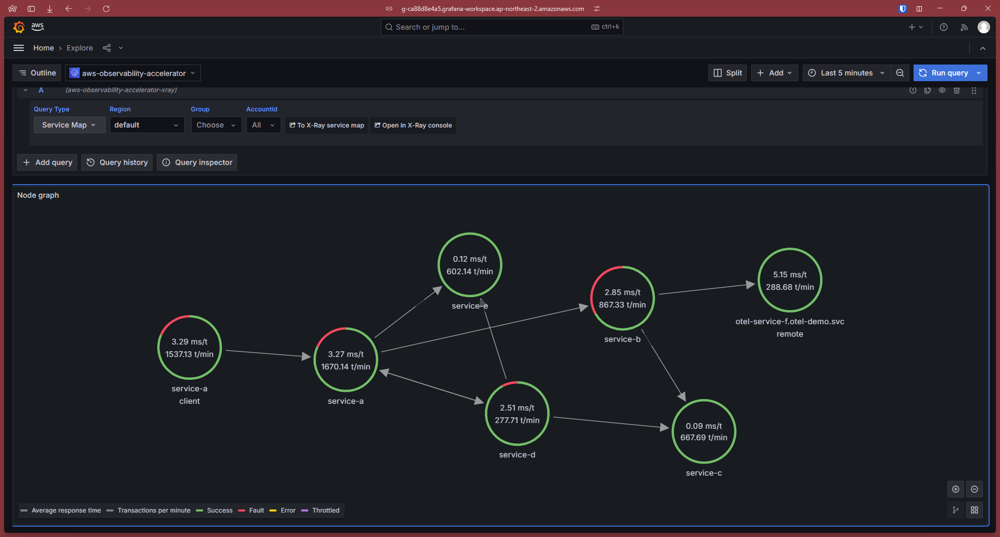
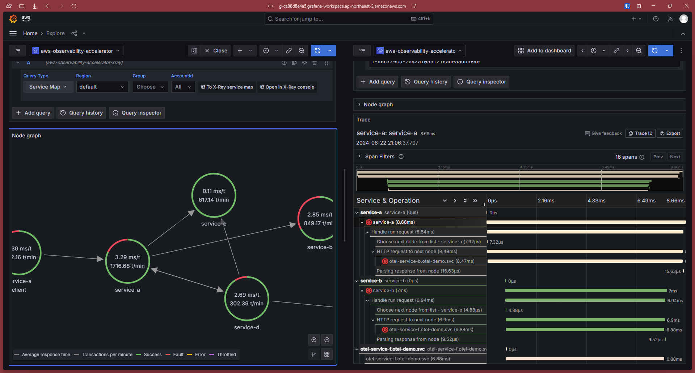
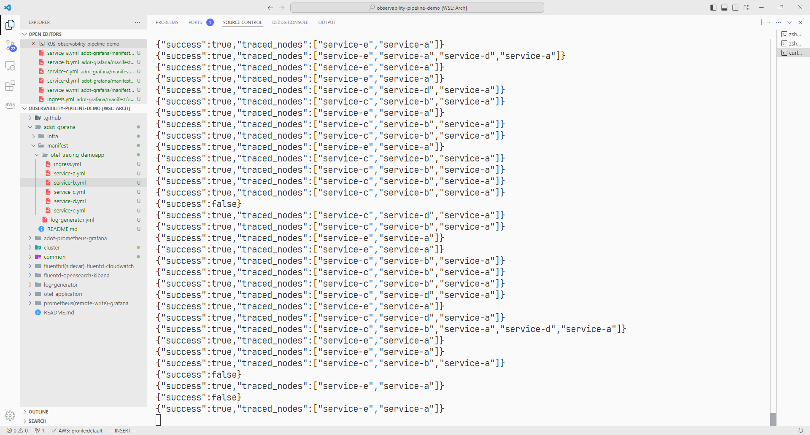

# otel-tracing-demoapp
MSA demo application for OpenTelemetry tracing

## Demo
[](./docs/image.png)
*Trace List

[](./docs/image2.png)
*Service Map

[](./docs/image4.png)
*In a single page

[](./docs/image3.png)
*output of load generator

## Environment Variables
* `NODE_NAME`: name for this node (default: `application`)

* `NODE_LISTEN`: listening host:port for this node (default: `0.0.0.0:3000`)

* `NEXT_NODE`: host:port combinations for next nodes\
  First item is more weighted than next item.\
  (example: `service-a.default.svc:3000,service-b.default.svc:3000`)

* `OTEL_SERVICE_NAME`: otel attribute for service name

* `OTEL_EXPORTER_OTLP_ENDPOINT`: otel endpoint for tracing

## Example Kubernetes Deployment
### `otel-service-a.yml`
```yml
apiVersion: apps/v1
kind: Deployment
metadata:
  name: otel-service-a
  namespace: otel-demo
  labels:
    app: otel-service-a
spec:
  selector:
    matchLabels:
      app: otel-service-a
  replicas: 3
  template:
    metadata:
      labels:
        app: otel-service-a
    spec:
      nodeSelector:
        dedicated: app
      tolerations:
        - key: dedicated
          value: app
      containers:
      - name: otel-service-a
        image: ghcr.io/pmh-only/otel-tracing-demoapp:latest
        resources:
          requests:
            cpu: 100m
            memory: 100Mi
          limits:
            cpu: 100m
            memory: 100Mi
        livenessProbe:
          tcpSocket:
            port: 3000
          initialDelaySeconds: 5
          timeoutSeconds: 5
          successThreshold: 1
          failureThreshold: 3
          periodSeconds: 10
        readinessProbe:
          httpGet:
            path: /healthz
            port: 3000
          initialDelaySeconds: 5
          timeoutSeconds: 2
          successThreshold: 1
          failureThreshold: 3
          periodSeconds: 10
        env:
        - name: NODE_NAME
          value: service-a
        - name: NEXT_NODE
          value: otel-service-b.otel-demo.svc:3000,otel-service-c.otel-demo.svc:3000
        - name: OTEL_SERVICE_NAME
          value: service-a
        - name: OTEL_EXPORTER_OTLP_ENDPOINT
          value: http://otel_endpoint:4317
---
apiVersion: v1
kind: Service
metadata:
  name: otel-service-a
  namespace: otel-demo
spec:
  selector:
    app: otel-service-a
  type: ClusterIP
  ports:
  - name: otel-service-a
    protocol: TCP
    port: 3000
    targetPort: 3000
```

### `otel-service-b.yml`
```yml
apiVersion: apps/v1
kind: Deployment
metadata:
  name: otel-service-b
  namespace: otel-demo
  labels:
    app: otel-service-b
spec:
  selector:
    matchLabels:
      app: otel-service-b
  replicas: 3
  template:
    metadata:
      labels:
        app: otel-service-b
    spec:
      nodeSelector:
        dedicated: app
      tolerations:
        - key: dedicated
          value: app
      containers:
      - name: otel-service-b
        image: ghcr.io/pmh-only/otel-tracing-demoapp:latest
        resources:
          requests:
            cpu: 100m
            memory: 100Mi
          limits:
            cpu: 100m
            memory: 100Mi
        livenessProbe:
          tcpSocket:
            port: 3000
          initialDelaySeconds: 5
          timeoutSeconds: 5
          successThreshold: 1
          failureThreshold: 3
          periodSeconds: 10
        readinessProbe:
          httpGet:
            path: /healthz
            port: 3000
          initialDelaySeconds: 5
          timeoutSeconds: 2
          successThreshold: 1
          failureThreshold: 3
          periodSeconds: 10
        env:
        - name: NODE_NAME
          value: service-b
        - name: NEXT_NODE
          value: ''
        - name: OTEL_SERVICE_NAME
          value: service-b
        - name: OTEL_EXPORTER_OTLP_ENDPOINT
          value: http://otel_endpoint:4317
---
apiVersion: v1
kind: Service
metadata:
  name: otel-service-b
  namespace: otel-demo
spec:
  selector:
    app: otel-service-b
  type: ClusterIP
  ports:
  - name: otel-service-b
    protocol: TCP
    port: 3000
    targetPort: 3000
```

### `otel-service-c.yml`
```yml
apiVersion: apps/v1
kind: Deployment
metadata:
  name: otel-service-c
  namespace: otel-demo
  labels:
    app: otel-service-c
spec:
  selector:
    matchLabels:
      app: otel-service-c
  replicas: 3
  template:
    metadata:
      labels:
        app: otel-service-c
    spec:
      nodeSelector:
        dedicated: app
      tolerations:
        - key: dedicated
          value: app
      containers:
      - name: otel-service-c
        image: ghcr.io/pmh-only/otel-tracing-demoapp:latest
        resources:
          requests:
            cpu: 100m
            memory: 100Mi
          limits:
            cpu: 100m
            memory: 100Mi
        livenessProbe:
          tcpSocket:
            port: 3000
          initialDelaySeconds: 5
          timeoutSeconds: 5
          successThreshold: 1
          failureThreshold: 3
          periodSeconds: 10
        readinessProbe:
          httpGet:
            path: /healthz
            port: 3000
          initialDelaySeconds: 5
          timeoutSeconds: 2
          successThreshold: 1
          failureThreshold: 3
          periodSeconds: 10
        env:
        - name: NODE_NAME
          value: service-c
        - name: NEXT_NODE
          value: otel-service-b.otel-demo.svc:3000,otel-service-a.otel-demo.svc:3000
        - name: OTEL_SERVICE_NAME
          value: service-c
        - name: OTEL_EXPORTER_OTLP_ENDPOINT
          value: http://otel_endpoint:4317
---
apiVersion: v1
kind: Service
metadata:
  name: otel-service-c
  namespace: otel-demo
spec:
  selector:
    app: otel-service-c
  type: ClusterIP
  ports:
  - name: otel-service-c
    protocol: TCP
    port: 3000
    targetPort: 3000
```
